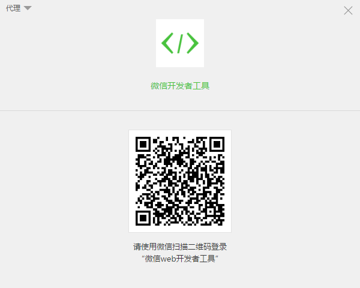
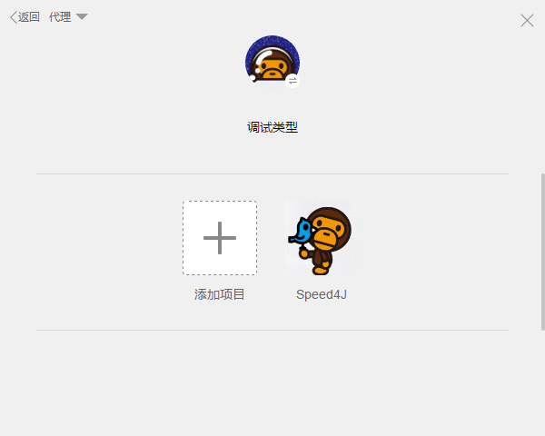
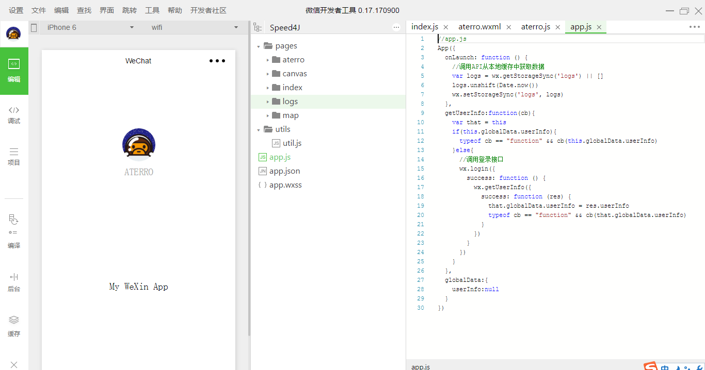
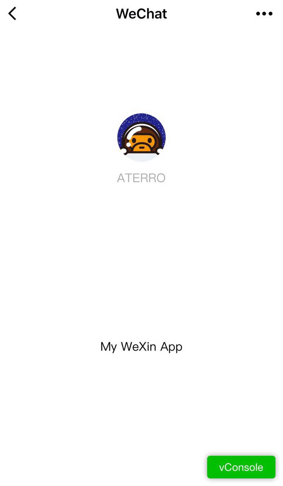
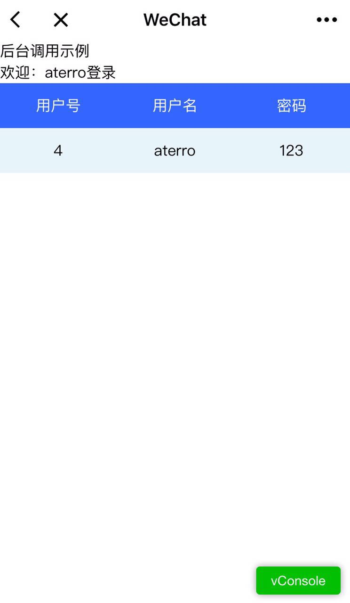
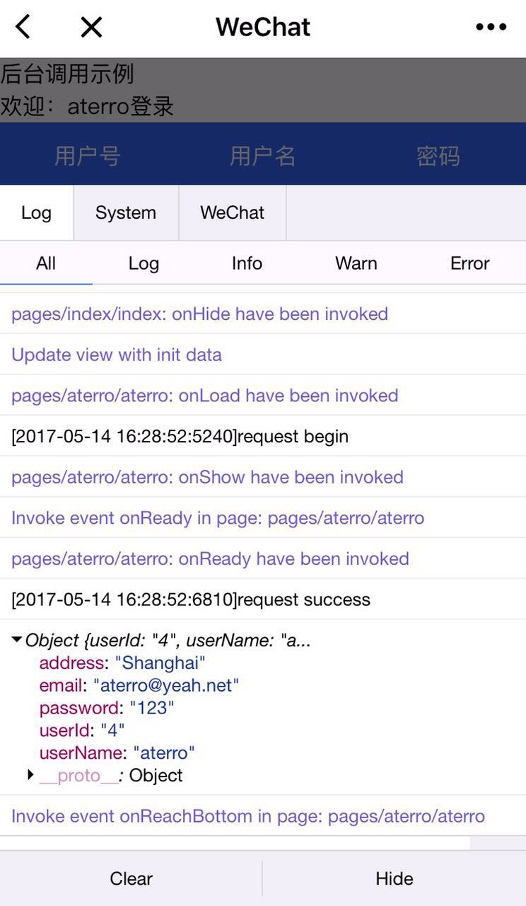

# WeChatApp

# 获取微信小程序的 AppID
登录 https://mp.weixin.qq.com ，就可以在网站的“设置”-“开发者设置”中，查看到微信小程序的 AppID 了，注意不可直接使用服务号或订阅号的 AppID 。

# 现在小程序开发工具
登录 https://mp.weixin.qq.com/debug/wxadoc/dev/devtools/devtools.html ，下载小程序开发工具

# 创建项目
我们需要通过开发者工具，来完成小程序创建和代码编辑。

# 编写代码
创建小程序实例,点击开发者工具左侧导航的“编辑”，我们可以看到这个项目，已经初始化并包含了一些简单的代码文件。最关键也是必不可少的，是 app.js、app.json、app.wxss 这三个。

# 手机预览
开发者工具左侧菜单栏选择"项目"，点击"预览"，扫码后即可在微信客户端中体验。

----------

----------

----------

